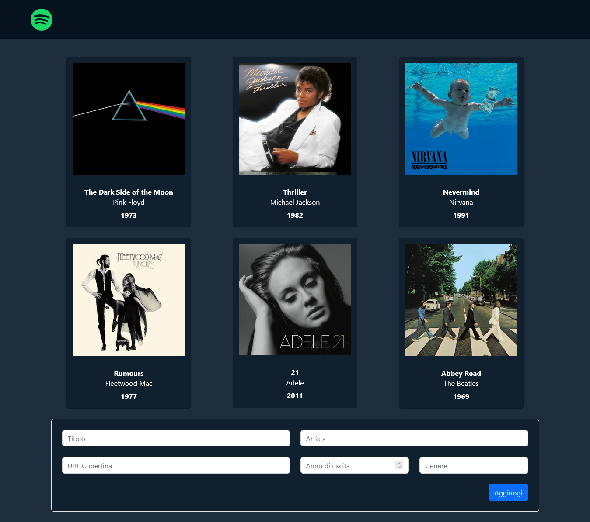
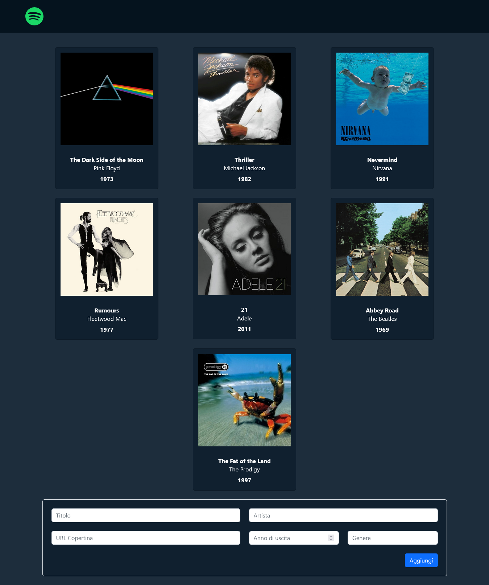

# PHP Album Collection

## Descrizione

Web app PHP che mostra una raccolta di album musicali leggendo i dati da un file JSON.

L'applicazione:
- Mostra una griglia di **card** con le informazioni degli album.
- Permette all’utente di **aggiungere un nuovo album** tramite un form.
- Utilizza **Bootstrap 5** per uno stile moderno e responsive.

---

## Tecnologie

- **PHP** (gestione dati e logica)
- **JSON** (file dati per la lista degli album)
- **HTML5**
- **Bootstrap 5** (per la UI)
- **CSS personalizzato**

---

## Struttura Funzionale

- I dati degli album sono salvati in un file `.json`.
- Il file `server.php`:
  - Legge i dati dal JSON.
  - Gestisce l’aggiunta di un nuovo album se i dati arrivano tramite `POST`.
- Il file `index.php`:
  - Include `server.php`.
  - Mostra la lista degli album in formato **card Bootstrap**.
  - Mostra il **form** per inserire un nuovo album.

Ogni album include:
- Titolo
- Artista
- URL della copertina
- Anno di pubblicazione
- Genere musicale

---

## Come Funziona

1. All’avvio della pagina, il sistema legge la lista di album da un file JSON.
2. Gli album vengono mostrati come card Bootstrap nella griglia centrale.
3. L’utente può compilare un form per **aggiungere un nuovo album**.
4. I dati vengono inviati via `POST` al server e salvati nel JSON.
5. La pagina si aggiorna e mostra anche il nuovo album appena inserito.

---

## Esempi di Uso

- Senza inserimenti: la pagina mostra la lista base di album caricati dal file.
- Dopo l’uso del form: la nuova card dell’album viene visualizzata insieme alle altre.

---

## Screenshot

### Prima dell'inserimento:

### Dopo l'aggiunta di un album:

---

## Note

- L’aggiunta di album è **persistente**: ogni invio modifica il file JSON.
- Il form utilizza i campi `required` per evitare l’invio di dati incompleti.
- Ogni campo ha il proprio `placeholder` per indicare all’utente cosa inserire.

---

## Bonus

- ✅ **Aggiunta album** tramite form con POST.
- ✅ **Salvataggio persistente** dei dati in JSON.
- ✅ **Stile responsive** con Bootstrap.
- ✅ **Visualizzazione a card** degli album.

---

